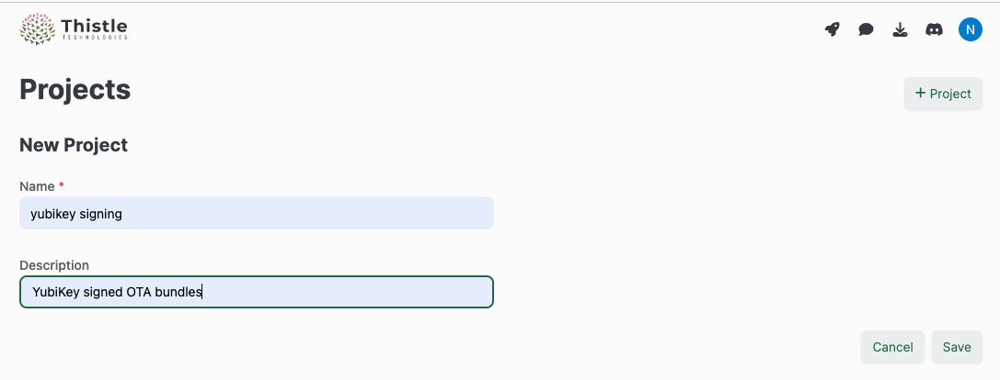
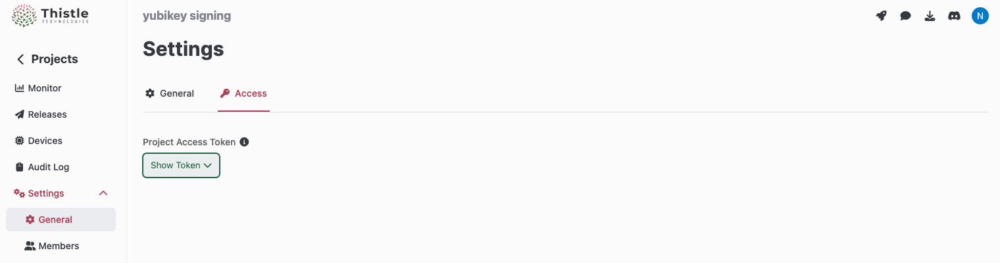

# trh-y: Thistle Release Helper with YubiKey Signing

[](https://github.com/thistletech/trh-y/actions/workflows/sanity.yml)

This repository contains the tools and instructions for releasing a Thistle OTA
update bundle signed with a key protected by a YubiKey.

## FAQ

- Q: What types of YubiKeys will work?

  A: Any device in the YubiKey 5 series should work. Earlier versions of
  YubiKeys *may* work, but are not thoroughly tested.

- Q: Can the private signing key be exported outside of a provisioned YubiKey
  so I can back it up?

  A: No. The private key cannot be exported from the YubiKey hardware.

- Q: What if a provisioned YubiKey is lost, stolen or broken?

  A: Although the private signing key cannot be exported/leaked from the
  YubiKey, losing a production signing key can be catastrophic. To mitigate the
  risk, one may provision multiple YubiKeys, and add the associated public keys
  to `tuc`'s configuration JSON file for redundancy. The YubiKeys used
  in production signing should be kept safe. Specifically, an organization should
  consider establishing a key update process for fielded devices, and designing
  and performing regular disaster recover exercises to mitigate the risk of a lost
  key. Production keys should always be taken seriously!

- Q: We cannot easily update public signing keys in our fielded devices. Is
  there an alternative?

  A: If your devices cannot update the OTA bundle public signing keys easily
  after they leave the manufacturing facility (e.g., keys are fused in
  hardware), you may consider managing your signing keys using a Could Key
  Management System (KMS), for which hardware failures are practically not a
  concern (you do need to have a Cloud account). Thistle provides an external
  signing tool [trh-k](https://github.com/thistletech/trh-k) to help you do it
  with ease.

## System Requirements

You need

- MacOS (`x86_64` or `aarch64`) or Linux (`x86_64`, tested on Ubuntu)
- A [YubiKey](https://www.yubico.com/products/) (tested on YubiKey 5)

## Provision YubiKey for Signing (One-Time Setup)

This step only needs to be done once per release signing key.

- First, clone this repository, including its submodule.

  ```bash
  # use --recursive instead of --recurse-submodules for older Git versions
  git clone --recurse-submodules https://github.com/thistletech/trh-y.git
  ```

  Or (if you did not use the `--recursive` option when cloning the repository)

  ```bash
  git clone https://github.com/thistletech/trh-y.git
  cd trh-y
  git submodule update --init --recursive
  ```

- Follow [these
  instructions](https://github.com/thistletech/yubisign/blob/main/README.md#install-dependencies)
  to install dependencies of
  [yubisign](https://github.com/thistletech/yubisign).

- Generate a new `pivit` key pair in the YubiKey for OTA bundle signing

  Under the directory root of `trh-y`

  ```bash
  $ thistle-bin/keygen-y
  # Example output
  Please add the following public key to the public_keys array in TUC configuration:
  pivit:MIICcjCCAVqgAwIBAgIQAcSbbBRftUAwYtLVH3ewmTANBgkqhkiG9w0BAQsFADAhMR8wHQYDVQQDDBZZdWJpY28gUElWIEF0dGVzdGF0aW9uMCAXDTE2MDMxNDAwMDAwMFoYDzIwNTIwNDE3MDAwMDAwWjAlMSMwIQYDVQQDDBpZdWJpS2V5IFBJViBBdHRlc3RhdGlvbiA5ZTB2MBAGByqGSM49AgEGBSuBBAAiA2IABNlQN+0/nPF4OhrUXESFcjfYKKXIcsRRZQ5N76b9Jz6KcsKZl79LiAjIhk6pAC4hE3D13CrXxC/KQgwxxV+3qINmcIpxIvwvi4QdOwm0PMPyBTdDo1vkDDKi239rfQb/jqNOMEwwEQYKKwYBBAGCxAoDAwQDBQIHMBQGCisGAQQBgsQKAwcEBgIEANsSlzAQBgorBgEEAYLECgMIBAIBAjAPBgorBgEEAYLECgMJBAEBMA0GCSqGSIb3DQEBCwUAA4IBAQCKWWgcGKkSKE5TR7e5EIjs2OPk+vTQFfydPur8iJoR7vxuUvNRtd5mIlRWLxzc4Q/dG10asO5x0ehtYWi998izHqdW0t3zhPSdhdsksYTcFEjkeu3JZpahRH2ZdQUjUYobCzxbqEE3upBjfdiZI8BbkMtn66UMxNlVBISvrQnuFKFH97qkVoK8mWpIuXvlQBI55VHg1vTJgAe/diJtDLcgF+Ug2urPBfMrFp0O/A7pX4fKE5SRfI/vwiujnu35xvRy2oD8xSWSkfDEnD2DxeIrYMworUW8W0Vfpd3+2d+GPcX34BxKjBbMlR6XNgk+OavcCUl9/jpLLgXgFxRkYuDS
  ```

  Save the public key value for the initialization step later, or one can run
  `keygen-y` again to print the public key value to the console.

## Create Device Project and Obtain Access Token (One-Time Setup)

1. Login to the [Thistle Web app](https://app.thistle.tech/projects/), and
   create a new project where your fleet of devices associated with the OTA
   bundle are managed. In the example below, we name the project "yubikey
   signing".

   

2. In the newly created project "yubikey signing", visit the "Settings" section
   of a project to obtain the API token to be used as `THISTLE_TOKEN` in the
   initialization step below.

   

## Initialization (One-Time Setup)

In the project initialization step, we generate a release manifest file
(`manifest.json`) using the Thistle Release Helper (`trh`).

- The manifest file will be used by a release operator, with the help of `trh`,
  to describe an OTA bundle for devices in the project.

On a Linux or macOS machine where the provisioned YubiKey is inserted,
initialize the project as follows.

```bash
# Create an empty "release" directory for the tutorial, and change to it
$ mkdir release
$ cd release
# Clone this repository
$ git clone --recursive https://github.com/thistletech/trh-y.git
# Activate Hermit, and run subsequent commands in Hermit environment
$ . trh-y/bin/activate-hermit
# Paste the "Access Token" of the project obtained from Thistle portal, and type
# `enter + ctrl-d`. Use this command to prevent the sensitive $THISTLE_TOKEN
# from being logged in bash history
trh-y🐚 $ export THISTLE_TOKEN=$(cat)
trh-y🐚 $ trh init
...
Manifest generated at: "./manifest.json"
```

- An example of `manifest.json` created in this step.

  ```json
  {
    "comment": null,
    "id": "01GK5TNHH687GMXA18ZSS43JC4",
    "ts": "1669864277.542302000",
    "version": 1,
    "name": "default",
    "signature": "",
    "pre_install": null,
    "post_install": null,
    "post_reboot": null,
    "rootfs": null,
    "files": [],
    "status": null,
    "path": null
  }
  ```

## Prepare, Sign and Release OTA Bundle

As with [File Update](https://docs.thistle.tech/update/get_started/file_update)
and [Full System
Update](https://docs.thistle.tech/update/get_started/rpi), we use
`trh`'s subcommands `prepare` and `release` to prepare, sign and release OTA
bundles, but also supply the `--external-sign` argument for YubiKey signing.

Let's use the following file update case as an example.

In the `release` directory on a Linux or macOS machine where the provisioned
YubiKey is inserted, run the follow commands. Make sure `manifest.json` is
directly under `release/`.

```bash
# Activate Hermit, and run subsequent commands in Hermit environment
$ . trh-y/bin/activate-hermit
# Paste the "Access Token" of the project obtained from Thistle portal, and type
# enter + ctrl-d
trh-y🐚 $ export THISTLE_TOKEN=$(cat)
# Prepare a local OTA bundle
trh-y🐚 $ mkdir -p rel/tmp
trh-y🐚 $ echo "This is a test" > rel/tmp/test.txt
trh-y🐚 $ trh --external-sign "trh-y/thistle-bin/sign-y" prepare --target=./rel --file-base-path=/
Read manifest at "./manifest.json"
Processed file "./rel/tmp/test.txt"
Executing external signing command
=====
Signing /var/folders/5k/pbgrbj194573msk705r200sc0000gn/T/tmp.gALetxzM with YubiKey. Touch your YubiKey if it blinks.
=====
Manifest amended successfully
# Release OTA bundle to Thistle backend
trh-y🐚 $ trh --external-sign "trh-y/thistle-bin/sign-y" release
Read manifest at "./manifest.json"
Executing external signing command
=====
Signing /var/folders/5k/pbgrbj194573msk705r200sc0000gn/T/tmp.SSNRixzn with YubiKey. Touch your YubiKey if it blinks.
=====
Prepared backup release
Uploaded asset test.txt
Executing external signing command
=====
Signing /var/folders/5k/pbgrbj194573msk705r200sc0000gn/T/tmp.Km3MGeJT with YubiKey. Touch your YubiKey if it blinks.
=====
Backup manifest uploaded successfully
Manifest uploaded successfully
Local compressed artifacts removed
```

To update an existing release, re-run `trh prepare` and `trh release` commands
with the `--external-sign` argument exactly as above, and as described
[here](https://docs.thistle.tech/update/get_started/file_update#upload-a-new-update-bundle),
to get the manifest updated and signed, and OTA bundle uploaded to Thistle
backend.

## Test Release Update

On the machine where an OTA update release was published, generate a device
configuraiton file `config.json`.

```bash
trh-k🐚 $ trh --signing-method="external" --public-key=<PUBLIC_KEY> \
gen-device-config \
--device-name="my-demo-device" \
--enrollment-type="group-enroll" \
--persist="${HOME}/thistle-ota"
```

Here, `<PUBLIC_KEY>` is the public key value shown in the YubiKey provisioning
step.

- An example of `config.json` created in this step.

  ```json
  {
      "name": "my-demo-device",
      "persistent_directory": "/home/thistle/thistle-ota",
      "device_enrollment_token": "redacted_device_enrollment_token",
      "public_keys": ["pivit:MIICcjCCAVqgAwIBAgIQAcSbbBRftUAwYtLVH3ewmTANBgkqhkiG9w0BAQsFADAhMR8wHQYDVQQDDBZZdWJpY28gUElWIEF0dGVzdGF0aW9uMCAXDTE2MDMxNDAwMDAwMFoYDzIwNTIwNDE3MDAwMDAwWjAlMSMwIQYDVQQDDBpZdWJpS2V5IFBJViBBdHRlc3RhdGlvbiA5ZTB2MBAGByqGSM49AgEGBSuBBAAiA2IABNlQN+0/nPF4OhrUXESFcjfYKKXIcsRRZQ5N76b9Jz6KcsKZl79LiAjIhk6pAC4hE3D13CrXxC/KQgwxxV+3qINmcIpxIvwvi4QdOwm0PMPyBTdDo1vkDDKi239rfQb/jqNOMEwwEQYKKwYBBAGCxAoDAwQDBQIHMBQGCisGAQQBgsQKAwcEBgIEANsSlzAQBgorBgEEAYLECgMIBAIBAjAPBgorBgEEAYLECgMJBAEBMA0GCSqGSIb3DQEBCwUAA4IBAQCKWWgcGKkSKE5TR7e5EIjs2OPk+vTQFfydPur8iJoR7vxuUvNRtd5mIlRWLxzc4Q/dG10asO5x0ehtYWi998izHqdW0t3zhPSdhdsksYTcFEjkeu3JZpahRH2ZdQUjUYobCzxbqEE3upBjfdiZI8BbkMtn66UMxNlVBISvrQnuFKFH97qkVoK8mWpIuXvlQBI55VHg1vTJgAe/diJtDLcgF+Ug2urPBfMrFp0O/A7pX4fKE5SRfI/vwiujnu35xvRy2oD8xSWSkfDEnD2DxeIrYMworUW8W0Vfpd3+2d+GPcX34BxKjBbMlR6XNgk+OavcCUl9/jpLLgXgFxRkYuDS"]
  }
  ```

  This configuration file can be used as a template for other devices in the
  same project. While `persistent_directory`, `device_enrollment_token` and
  `public_keys` values are shared by all devices in the project, the fields
  `name` and`device_id` can be device unique, and customizable according to a
  customer's device management setting.

  Note that the above device configuration file is for a "group enrollment"
  model: Suppose `device_id` is missing from `config.json`, and
  `device_enrollment_token` is valid.  During the first HTTP request from TUC to
  the backend `device_id` is not present. In this case, this request will be
  viewed as a "device provisioning" request (authorized by
  `device_enrollment_token`): a new, unique `device_id` and `device_token` will
  be automatically created on the backend, and returned to the client to
  persist.  Subsequent client-initiated requests will have `device_id` and
  `device_token` values included for device authentication and authorization.

A "pre-enrollment" model is also supported by TRH by setting
`--enrollment-model="pre-enroll` in the command above. This will generate a
`config.json` file with unique `device_id` and `device_token` in it, without
obtaining a `device_enrollment_token`. For the two device provisioning models,
refer to [Device
Provisioning](https://docs.thistle.tech/update/device_provisioning) in Thistle's
documentation.

On a device running `tuc`, run the following command to test the released OTA
bundle, using `config.json`. This is similar to what is described
[here](https://docs.thistle.tech/update/get_started/file_update#upload-and-test-deployed-release).

```bash
trh-y🐚 $ tuc --log-level=info -c config.json
...
!! setting update status to Pass
.. signature verified with public key #0 type pivit
.. reported data to server
~~ next check in 3600s
```

## Synopsis of trh-y Commands

- thistle-bin/keygen-y

  ```text
  Usage:
    keygen-y -h
      Display this help message
    keygen-y [-f]
      If YubiKey is already provisioned, prints out certificate string.
      Otherwise, generates a new key pair in the YubiKey. When the -f flag
      is present, force generates a new key pair.
  ```

- thistle-bin/sign-y

  ```text
  Usage:
    sign-y -h
      Display this help message
    thistle-bin/sign-y SIGNABLE_STRING
      Signs SIGNABLE_STRING using yubisign
  ```
